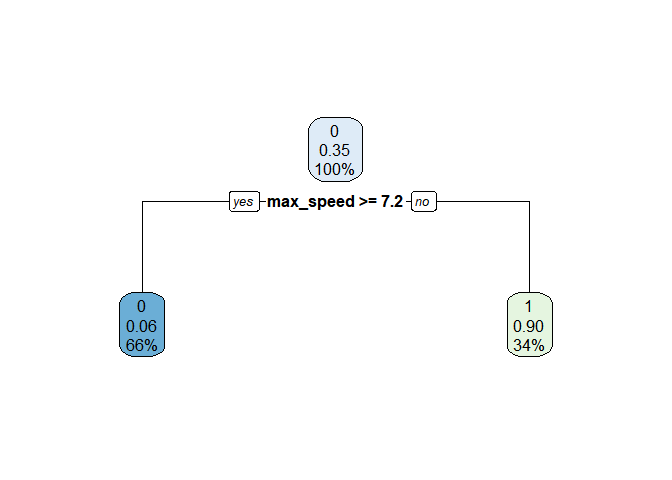

Proyecto 3
================

## Librerias

``` r
library(tidyverse)
```

    ## -- Attaching packages --------------------------------------- tidyverse 1.3.1 --

    ## v ggplot2 3.3.4     v purrr   0.3.4
    ## v tibble  3.1.2     v dplyr   1.0.6
    ## v tidyr   1.1.3     v stringr 1.4.0
    ## v readr   1.4.0     v forcats 0.5.1

    ## -- Conflicts ------------------------------------------ tidyverse_conflicts() --
    ## x dplyr::filter() masks stats::filter()
    ## x dplyr::lag()    masks stats::lag()

``` r
library(GGally)
```

    ## Registered S3 method overwritten by 'GGally':
    ##   method from   
    ##   +.gg   ggplot2

``` r
library(regclass)
```

    ## Loading required package: bestglm

    ## Loading required package: leaps

    ## Loading required package: VGAM

    ## Loading required package: stats4

    ## Loading required package: splines

    ## 
    ## Attaching package: 'VGAM'

    ## The following object is masked from 'package:tidyr':
    ## 
    ##     fill

    ## Loading required package: rpart

    ## Loading required package: randomForest

    ## randomForest 4.6-14

    ## Type rfNews() to see new features/changes/bug fixes.

    ## 
    ## Attaching package: 'randomForest'

    ## The following object is masked from 'package:dplyr':
    ## 
    ##     combine

    ## The following object is masked from 'package:ggplot2':
    ## 
    ##     margin

    ## Important regclass change from 1.3:
    ## All functions that had a . in the name now have an _
    ## all.correlations -> all_correlations, cor.demo -> cor_demo, etc.

``` r
library(pROC)
```

    ## Type 'citation("pROC")' for a citation.

    ## 
    ## Attaching package: 'pROC'

    ## The following objects are masked from 'package:stats':
    ## 
    ##     cov, smooth, var

``` r
library(rsample)
library('corrplot')
```

    ## corrplot 0.89 loaded

``` r
library(dplyr)
library(utf8)
library("ggplot2")
library(stringr)
library(pillar)
```

    ## 
    ## Attaching package: 'pillar'

    ## The following object is masked from 'package:dplyr':
    ## 
    ##     dim_desc

``` r
library("psych")
```

    ## 
    ## Attaching package: 'psych'

    ## The following object is masked from 'package:randomForest':
    ## 
    ##     outlier

    ## The following objects are masked from 'package:VGAM':
    ## 
    ##     fisherz, logistic, logit

    ## The following objects are masked from 'package:ggplot2':
    ## 
    ##     %+%, alpha

``` r
library("car")
```

    ## Loading required package: carData

    ## 
    ## Attaching package: 'car'

    ## The following object is masked from 'package:psych':
    ## 
    ##     logit

    ## The following object is masked from 'package:VGAM':
    ## 
    ##     logit

    ## The following object is masked from 'package:dplyr':
    ## 
    ##     recode

    ## The following object is masked from 'package:purrr':
    ## 
    ##     some

``` r
library("Hmisc")
```

    ## Loading required package: lattice

    ## 
    ## Attaching package: 'lattice'

    ## The following object is masked from 'package:regclass':
    ## 
    ##     qq

    ## Loading required package: survival

    ## Loading required package: Formula

    ## 
    ## Attaching package: 'Hmisc'

    ## The following object is masked from 'package:psych':
    ## 
    ##     describe

    ## The following objects are masked from 'package:dplyr':
    ## 
    ##     src, summarize

    ## The following objects are masked from 'package:base':
    ## 
    ##     format.pval, units

``` r
library("corrplot")
library("recommenderlab")
```

    ## Loading required package: Matrix

    ## 
    ## Attaching package: 'Matrix'

    ## The following objects are masked from 'package:tidyr':
    ## 
    ##     expand, pack, unpack

    ## Loading required package: arules

    ## 
    ## Attaching package: 'arules'

    ## The following object is masked from 'package:car':
    ## 
    ##     recode

    ## The following object is masked from 'package:dplyr':
    ## 
    ##     recode

    ## The following objects are masked from 'package:base':
    ## 
    ##     abbreviate, write

    ## Loading required package: proxy

    ## 
    ## Attaching package: 'proxy'

    ## The following object is masked from 'package:Matrix':
    ## 
    ##     as.matrix

    ## The following objects are masked from 'package:stats':
    ## 
    ##     as.dist, dist

    ## The following object is masked from 'package:base':
    ## 
    ##     as.matrix

    ## Loading required package: registry

    ## Registered S3 methods overwritten by 'registry':
    ##   method               from 
    ##   print.registry_field proxy
    ##   print.registry_entry proxy

``` r
library(readr)
library(discrim)
```

    ## Loading required package: parsnip

    ## 
    ## Attaching package: 'parsnip'

    ## The following object is masked from 'package:Hmisc':
    ## 
    ##     translate

``` r
library(tidymodels)
```

    ## Registered S3 method overwritten by 'tune':
    ##   method                   from   
    ##   required_pkgs.model_spec parsnip

    ## -- Attaching packages -------------------------------------- tidymodels 0.1.3 --

    ## v broom        0.7.7      v tune         0.1.5 
    ## v dials        0.0.9      v workflows    0.2.2 
    ## v infer        0.5.4      v workflowsets 0.0.2 
    ## v modeldata    0.1.0      v yardstick    0.0.8 
    ## v recipes      0.1.16

    ## -- Conflicts ----------------------------------------- tidymodels_conflicts() --
    ## x psych::%+%()                masks ggplot2::%+%()
    ## x scales::alpha()             masks psych::alpha(), ggplot2::alpha()
    ## x randomForest::combine()     masks dplyr::combine()
    ## x pillar::dim_desc()          masks dplyr::dim_desc()
    ## x scales::discard()           masks purrr::discard()
    ## x recipes::discretize()       masks arules::discretize()
    ## x Matrix::expand()            masks tidyr::expand()
    ## x VGAM::fill()                masks tidyr::fill()
    ## x dplyr::filter()             masks stats::filter()
    ## x recipes::fixed()            masks stringr::fixed()
    ## x dplyr::lag()                masks stats::lag()
    ## x randomForest::margin()      masks ggplot2::margin()
    ## x Matrix::pack()              masks tidyr::pack()
    ## x dials::prune()              masks rpart::prune()
    ## x arules::recode()            masks car::recode(), dplyr::recode()
    ## x car::some()                 masks purrr::some()
    ## x yardstick::spec()           masks readr::spec()
    ## x Hmisc::src()                masks dplyr::src()
    ## x recipes::step()             masks stats::step()
    ## x Hmisc::summarize()          masks dplyr::summarize()
    ## x parsnip::translate()        masks Hmisc::translate()
    ## x Matrix::unpack()            masks tidyr::unpack()
    ## x recipes::update()           masks Matrix::update(), stats4::update(), stats::update()
    ## x workflows::update_formula() masks VGAM::update_formula()
    ## * Use tidymodels_prefer() to resolve common conflicts.

``` r
library(caret)
```

    ## 
    ## Attaching package: 'caret'

    ## The following objects are masked from 'package:yardstick':
    ## 
    ##     precision, recall, sensitivity, specificity

    ## The following objects are masked from 'package:recommenderlab':
    ## 
    ##     MAE, RMSE

    ## The following object is masked from 'package:survival':
    ## 
    ##     cluster

    ## The following object is masked from 'package:VGAM':
    ## 
    ##     predictors

    ## The following object is masked from 'package:purrr':
    ## 
    ##     lift

``` r
library(plyr)
```

    ## ------------------------------------------------------------------------------

    ## You have loaded plyr after dplyr - this is likely to cause problems.
    ## If you need functions from both plyr and dplyr, please load plyr first, then dplyr:
    ## library(plyr); library(dplyr)

    ## ------------------------------------------------------------------------------

    ## 
    ## Attaching package: 'plyr'

    ## The following objects are masked from 'package:Hmisc':
    ## 
    ##     is.discrete, summarize

    ## The following objects are masked from 'package:dplyr':
    ## 
    ##     arrange, count, desc, failwith, id, mutate, rename, summarise,
    ##     summarize

    ## The following object is masked from 'package:purrr':
    ## 
    ##     compact

``` r
library(rpart)
library(rpart.plot)
library(e1071)
```

    ## 
    ## Attaching package: 'e1071'

    ## The following object is masked from 'package:tune':
    ## 
    ##     tune

    ## The following object is masked from 'package:Hmisc':
    ## 
    ##     impute

    ## The following object is masked from 'package:rsample':
    ## 
    ##     permutations

``` r
library(rattle)  
```

    ## Loading required package: bitops

    ## 
    ## Attaching package: 'bitops'

    ## The following object is masked from 'package:Matrix':
    ## 
    ##     %&%

    ## Rattle: A free graphical interface for data science with R.
    ## Versión 5.4.0 Copyright (c) 2006-2020 Togaware Pty Ltd.
    ## Escriba 'rattle()' para agitar, sacudir y  rotar sus datos.

    ## 
    ## Attaching package: 'rattle'

    ## The following object is masked from 'package:randomForest':
    ## 
    ##     importance

    ## The following object is masked from 'package:VGAM':
    ## 
    ##     wine

``` r
library(ROCR) 
```

# Cargar Datos

``` r
db <- readRDS("endurance (1).rds")
 #View(db)
```

# Limpieza de Datos

Comenzamos eliminando los datos NA.

``` r
db = na.omit(db)
dim(db)
```

    ## [1] 151990     16

# Observamos el dataframe y sus tipos de datos.

``` r
str(db)
```

    ## 'data.frame':    151990 obs. of  16 variables:
    ##  $ id                  : int  1 2 3 4 5 6 7 8 9 10 ...
    ##  $ type                : chr  "Ride" "Ride" "Ride" "Ride" ...
    ##  $ athlete             : num  13279977 13279977 13279977 13279977 13279977 ...
    ##  $ calories            : num  521 538 742 314 696 ...
    ##  $ distance            : num  13130 12939 17516 7931 17073 ...
    ##  $ elev_low            : chr  "337.3" "338.5" "301.6" "339.2" ...
    ##  $ records             : chr  "0" "1" "0" "0" ...
    ##  $ elev_high           : chr  "375.6" "477" "377" "389.7" ...
    ##  $ max_speed           : chr  "10.5" "11.4" "11.6" "10.2" ...
    ##  $ device_name         : chr  "Strava iPhone App" "Strava iPhone App" "Strava iPhone App" "Strava iPhone App" ...
    ##  $ moving_time         : num  3908 3791 3837 2280 4188 ...
    ##  $ elapsed_time        : num  4326 4975 4510 2521 4473 ...
    ##  $ average_speed       : chr  "3.36" "3.413" "4.565" "3.479" ...
    ##  $ has_heartrate       : chr  "FALSE" "FALSE" "FALSE" "FALSE" ...
    ##  $ start_date_local    : POSIXct, format: "2015-10-25 07:33:45" "2015-10-23 06:44:01" ...
    ##  $ total_elevation_gain: num  206 288 309 156 269 ...
    ##  - attr(*, "na.action")= 'omit' Named int [1:15625] 31 32 43 44 111 112 113 149 150 196 ...
    ##   ..- attr(*, "names")= chr [1:15625] "31" "32" "43" "44" ...

``` r
summary(db)
```

    ##        id             type              athlete            calories       
    ##  Min.   :     1   Length:151990      Min.   : 8558143   Min.   :     0.0  
    ##  1st Qu.: 41459   Class :character   1st Qu.:14127430   1st Qu.:   300.0  
    ##  Median : 82364   Mode  :character   Median :15550715   Median :   668.0  
    ##  Mean   : 83211                      Mean   :15305007   Mean   :   854.6  
    ##  3rd Qu.:125040                      3rd Qu.:16653350   3rd Qu.:  1130.4  
    ##  Max.   :167615                      Max.   :18078075   Max.   :326157.3  
    ##     distance         elev_low           records           elev_high        
    ##  Min.   :      0   Length:151990      Length:151990      Length:151990     
    ##  1st Qu.:   6986   Class :character   Class :character   Class :character  
    ##  Median :  13609   Mode  :character   Mode  :character   Mode  :character  
    ##  Mean   :  23128                                                           
    ##  3rd Qu.:  28980                                                           
    ##  Max.   :1479320                                                           
    ##   max_speed         device_name         moving_time        elapsed_time      
    ##  Length:151990      Length:151990      Min.   :       0   Min.   :        0  
    ##  Class :character   Class :character   1st Qu.:    2308   1st Qu.:     2702  
    ##  Mode  :character   Mode  :character   Median :    4050   Median :     4788  
    ##                                        Mean   :    5322   Mean   :    34998  
    ##                                        3rd Qu.:    6838   3rd Qu.:     8368  
    ##                                        Max.   :11025474   Max.   :511111044  
    ##  average_speed      has_heartrate      start_date_local             
    ##  Length:151990      Length:151990      Min.   :1999-04-25 17:36:38  
    ##  Class :character   Class :character   1st Qu.:2016-09-28 19:54:35  
    ##  Mode  :character   Mode  :character   Median :2018-11-22 05:56:50  
    ##                                        Mean   :2018-04-09 08:16:20  
    ##                                        3rd Qu.:2020-04-30 10:58:34  
    ##                                        Max.   :2021-02-02 08:52:05  
    ##  total_elevation_gain
    ##  Min.   :    0.0     
    ##  1st Qu.:   35.0     
    ##  Median :  242.0     
    ##  Mean   :  434.3     
    ##  3rd Qu.:  638.0     
    ##  Max.   :59595.0

De lo anterior podemos observar que en variables como moving time,
elapsed time y distance hay un minimo de 0, lo que no tiene mucho
sentido, por lo que veremos cuantas variables tienen valor y las
eliminaremos.

``` r
db %>% filter(moving_time == 0 ) %>% nrow()
```

    ## [1] 348

``` r
db %>% filter(elapsed_time == 0 ) %>% nrow()
```

    ## [1] 137

``` r
db %>% filter(distance == 0 ) %>% nrow() 
```

    ## [1] 3347

``` r
db <- db %>%  filter(moving_time != 0)
db <- db %>%  filter(elapsed_time != 0)
db <- db %>%  filter(distance != 0)

summary(db)
```

    ##        id             type              athlete            calories       
    ##  Min.   :     1   Length:148400      Min.   : 8558143   Min.   :     0.0  
    ##  1st Qu.: 41740   Class :character   1st Qu.:14204866   1st Qu.:   313.2  
    ##  Median : 82775   Mode  :character   Median :15550715   Median :   681.0  
    ##  Mean   : 83522                      Mean   :15308696   Mean   :   868.7  
    ##  3rd Qu.:125654                      3rd Qu.:16653350   3rd Qu.:  1145.3  
    ##  Max.   :167615                      Max.   :18078075   Max.   :326157.3  
    ##     distance           elev_low           records           elev_high        
    ##  Min.   :      0.1   Length:148400      Length:148400      Length:148400     
    ##  1st Qu.:   7374.8   Class :character   Class :character   Class :character  
    ##  Median :  14045.1   Mode  :character   Mode  :character   Mode  :character  
    ##  Mean   :  23686.3                                                           
    ##  3rd Qu.:  29593.0                                                           
    ##  Max.   :1479320.0                                                           
    ##   max_speed         device_name         moving_time       elapsed_time      
    ##  Length:148400      Length:148400      Min.   :      1   Min.   :        1  
    ##  Class :character   Class :character   1st Qu.:   2331   1st Qu.:     2726  
    ##  Mode  :character   Mode  :character   Median :   4113   Median :     4879  
    ##                                        Mean   :   5298   Mean   :    33063  
    ##                                        3rd Qu.:   6921   3rd Qu.:     8483  
    ##                                        Max.   :3156689   Max.   :511111044  
    ##  average_speed      has_heartrate      start_date_local             
    ##  Length:148400      Length:148400      Min.   :1999-04-25 17:36:38  
    ##  Class :character   Class :character   1st Qu.:2016-10-03 10:46:34  
    ##  Mode  :character   Mode  :character   Median :2018-11-26 17:00:52  
    ##                                        Mean   :2018-04-13 09:11:50  
    ##                                        3rd Qu.:2020-05-07 05:02:29  
    ##                                        Max.   :2021-02-02 08:30:38  
    ##  total_elevation_gain
    ##  Min.   :    0.0     
    ##  1st Qu.:   41.0     
    ##  Median :  259.0     
    ##  Mean   :  444.8     
    ##  3rd Qu.:  649.0     
    ##  Max.   :59595.0

Ahora, revisaremos la cantidad de factores de algunas variables para ver
si efectivamente seran utiles para nuestro analisis posterior. (En el
caso que tengan cantidad de factores similar a la cantidad de filas o
cantidad de factores igual a 1, esta variable se eliminaria)

``` r
db$athlete<-as.factor(db$athlete)
db$device_name<-as.factor(db$device_name)
db$records<-as.factor(db$records)
db$type<-as.factor(db$type)
db$has_heartrate<-as.factor(db$has_heartrate)


summary(db)
```

    ##        id                type                   athlete      
    ##  Min.   :     1   EBikeRide:  526   16288587.2590237:  3280  
    ##  1st Qu.: 41740   Hike     : 2057   14378444.2640879:  3132  
    ##  Median : 82775   Ride     :95977   12818944.799766 :  2348  
    ##  Mean   : 83522   Run      :47117   12815321.7794723:  2199  
    ##  3rd Qu.:125654   Walk     : 2723   14715160.3949943:  2090  
    ##  Max.   :167615                     15640386.2483545:  1999  
    ##                                     (Other)         :133352  
    ##     calories           distance           elev_low            records     
    ##  Min.   :     0.0   Min.   :      0.1   Length:148400      0      :96565  
    ##  1st Qu.:   313.2   1st Qu.:   7374.8   Class :character   1      :16760  
    ##  Median :   681.0   Median :  14045.1   Mode  :character   2      : 9000  
    ##  Mean   :   868.7   Mean   :  23686.3                      3      : 5662  
    ##  3rd Qu.:  1145.3   3rd Qu.:  29593.0                      4      : 3966  
    ##  Max.   :326157.3   Max.   :1479320.0                      5      : 2890  
    ##                                                            (Other):13557  
    ##   elev_high          max_speed                        device_name   
    ##  Length:148400      Length:148400      Strava iPhone App    :14519  
    ##  Class :character   Class :character   Garmin Edge 520      :12813  
    ##  Mode  :character   Mode  :character   Strava Android App   : 9505  
    ##                                        Garmin fēnix 3      : 9323  
    ##                                        Garmin Edge 510      : 6012  
    ##                                        Garmin Forerunner 235: 5445  
    ##                                        (Other)              :90783  
    ##   moving_time       elapsed_time       average_speed      has_heartrate
    ##  Min.   :      1   Min.   :        1   Length:148400      FALSE:60642  
    ##  1st Qu.:   2331   1st Qu.:     2726   Class :character   TRUE :87758  
    ##  Median :   4113   Median :     4879   Mode  :character                
    ##  Mean   :   5298   Mean   :    33063                                   
    ##  3rd Qu.:   6921   3rd Qu.:     8483                                   
    ##  Max.   :3156689   Max.   :511111044                                   
    ##                                                                        
    ##  start_date_local              total_elevation_gain
    ##  Min.   :1999-04-25 17:36:38   Min.   :    0.0     
    ##  1st Qu.:2016-10-03 10:46:34   1st Qu.:   41.0     
    ##  Median :2018-11-26 17:00:52   Median :  259.0     
    ##  Mean   :2018-04-13 09:11:50   Mean   :  444.8     
    ##  3rd Qu.:2020-05-07 05:02:29   3rd Qu.:  649.0     
    ##  Max.   :2021-02-02 08:30:38   Max.   :59595.0     
    ## 

Segun lo anterior, podemos ver que hasta ahora ninguna variable se
debería eliminar ya que no ocurrre ninguna de las 2 condiciones
anteriores. Pero somos capaces de identificar los 5 distintos factores
de la variable type: “EBike Ride”, “Hike”, “Ride”, “Run”y “Walk” .

Ahora continuaremos cambiando los tipos de variables a numérica para su
posterior procesamiento.

``` r
db$calories<-as.numeric(db$calories)
db$distance<-as.numeric(db$distance)
db$elev_low<-as.numeric(db$elev_low)
db$elev_high<-as.numeric(db$elev_high)
db$max_speed<-as.numeric(db$max_speed)
db$average_speed<-as.numeric(db$average_speed)
db$has_heartrate<-as.numeric(db$has_heartrate)
db$total_elevation_gain<-as.numeric(db$total_elevation_gain)
db$athlete<-as.numeric(db$athlete)
db$records<-as.numeric(db$records)
db$device_name<-as.numeric(db$device_name)
db$type<-as.numeric(db$type)

str(db)
```

    ## 'data.frame':    148400 obs. of  16 variables:
    ##  $ id                  : int  1 2 3 4 5 6 7 8 9 10 ...
    ##  $ type                : num  3 3 3 3 3 3 3 3 3 3 ...
    ##  $ athlete             : num  27 27 27 27 27 27 27 27 27 27 ...
    ##  $ calories            : num  521 538 742 314 696 ...
    ##  $ distance            : num  13130 12939 17516 7931 17073 ...
    ##  $ elev_low            : num  337 338 302 339 336 ...
    ##  $ records             : num  1 2 1 1 2 1 1 2 2 1 ...
    ##  $ elev_high           : num  376 477 377 390 389 ...
    ##  $ max_speed           : num  10.5 11.4 11.6 10.2 14.2 6.8 11.5 9.9 15.9 10.1 ...
    ##  $ device_name         : num  131 131 131 131 131 131 131 131 131 131 ...
    ##  $ moving_time         : num  3908 3791 3837 2280 4188 ...
    ##  $ elapsed_time        : num  4326 4975 4510 2521 4473 ...
    ##  $ average_speed       : num  3.36 3.41 4.57 3.48 4.08 ...
    ##  $ has_heartrate       : num  1 1 1 1 1 1 1 1 1 1 ...
    ##  $ start_date_local    : POSIXct, format: "2015-10-25 07:33:45" "2015-10-23 06:44:01" ...
    ##  $ total_elevation_gain: num  206 288 309 156 269 ...
    ##  - attr(*, "na.action")= 'omit' Named int [1:15625] 31 32 43 44 111 112 113 149 150 196 ...
    ##   ..- attr(*, "names")= chr [1:15625] "31" "32" "43" "44" ...

Una vez ya preparado el dataset, realizamos una visualizacion de nuestro
datos numericos, para ver la correlacion que pueda existir entre las
variables y la distribucion de los datos.

\#\# AGREGAR BOXPLOTSS

``` r
attach(db)

cor.plot(cbind(type, athlete, calories, distance, elev_low, elev_high, records, max_speed, moving_time, elapsed_time, average_speed, has_heartrate, total_elevation_gain, device_name))
```

<!-- -->

``` r
cor(x = cbind(type, athlete, calories, distance, elev_low, elev_high, records, max_speed, moving_time, elapsed_time, average_speed, has_heartrate, total_elevation_gain,  device_name), method = "pearson")
```

    ##                               type      athlete     calories     distance
    ## type                  1.0000000000  0.138911480 -0.044100018 -0.310809971
    ## athlete               0.1389114799  1.000000000 -0.114075161 -0.068628620
    ## calories             -0.0441000175 -0.114075161  1.000000000  0.511340019
    ## distance             -0.3108099707 -0.068628620  0.511340019  1.000000000
    ## elev_low             -0.0006480880 -0.090540366 -0.004048849 -0.123110463
    ## elev_high            -0.0685935002 -0.121854856  0.189208150  0.125780027
    ## records              -0.1608795357 -0.047519112  0.170991284  0.290023810
    ## max_speed            -0.5714385024 -0.182454340  0.235850357  0.580546677
    ## moving_time          -0.0813156813 -0.048504638  0.855736378  0.374395432
    ## elapsed_time          0.0004384296 -0.002876573  0.009658792  0.008215961
    ## average_speed        -0.1387521908 -0.001739654  0.024578645  0.174682614
    ## has_heartrate        -0.0147036058  0.050112431  0.028865304  0.112095888
    ## total_elevation_gain -0.1239152694 -0.114906261  0.371558891  0.436896265
    ## device_name           0.1190713194  0.083997013 -0.053059280 -0.172826819
    ##                          elev_low    elev_high      records    max_speed
    ## type                 -0.000648088 -0.068593500 -0.160879536 -0.571438502
    ## athlete              -0.090540366 -0.121854856 -0.047519112 -0.182454340
    ## calories             -0.004048849  0.189208150  0.170991284  0.235850357
    ## distance             -0.123110463  0.125780027  0.290023810  0.580546677
    ## elev_low              1.000000000  0.685567607  0.008963004 -0.068937264
    ## elev_high             0.685567607  1.000000000  0.117714380  0.113395956
    ## records               0.008963004  0.117714380  1.000000000  0.284684679
    ## max_speed            -0.068937264  0.113395956  0.284684679  1.000000000
    ## moving_time           0.006487169  0.144064249  0.120399261  0.184332458
    ## elapsed_time          0.001585785  0.006976945  0.003774630  0.003443026
    ## average_speed        -0.052599778 -0.037771424  0.041378828  0.177881497
    ## has_heartrate         0.018526700  0.035632110  0.030318310  0.002421710
    ## total_elevation_gain  0.041170090  0.541691377  0.199671073  0.284124307
    ## device_name          -0.001561284 -0.035025250 -0.028705764 -0.086695040
    ##                       moving_time  elapsed_time average_speed has_heartrate
    ## type                 -0.081315681  0.0004384296  -0.138752191 -0.0147036058
    ## athlete              -0.048504638 -0.0028765734  -0.001739654  0.0501124307
    ## calories              0.855736378  0.0096587918   0.024578645  0.0288653045
    ## distance              0.374395432  0.0082159606   0.174682614  0.1120958884
    ## elev_low              0.006487169  0.0015857854  -0.052599778  0.0185267004
    ## elev_high             0.144064249  0.0069769454  -0.037771424  0.0356321099
    ## records               0.120399261  0.0037746302   0.041378828  0.0303183096
    ## max_speed             0.184332458  0.0034430264   0.177881497  0.0024217096
    ## moving_time           1.000000000  0.0061135311   0.009755157  0.0333454376
    ## elapsed_time          0.006113531  1.0000000000   0.001467442  0.0005737263
    ## average_speed         0.009755157  0.0014674422   1.000000000  0.0124238256
    ## has_heartrate         0.033345438  0.0005737263   0.012423826  1.0000000000
    ## total_elevation_gain  0.266075158  0.0060677340   0.006117745  0.0447847565
    ## device_name          -0.051000954 -0.0045958149  -0.049686400 -0.3828595869
    ##                      total_elevation_gain  device_name
    ## type                         -0.123915269  0.119071319
    ## athlete                      -0.114906261  0.083997013
    ## calories                      0.371558891 -0.053059280
    ## distance                      0.436896265 -0.172826819
    ## elev_low                      0.041170090 -0.001561284
    ## elev_high                     0.541691377 -0.035025250
    ## records                       0.199671073 -0.028705764
    ## max_speed                     0.284124307 -0.086695040
    ## moving_time                   0.266075158 -0.051000954
    ## elapsed_time                  0.006067734 -0.004595815
    ## average_speed                 0.006117745 -0.049686400
    ## has_heartrate                 0.044784757 -0.382859587
    ## total_elevation_gain          1.000000000 -0.065547542
    ## device_name                  -0.065547542  1.000000000

``` r
table(db$type)
```

    ## 
    ##     1     2     3     4     5 
    ##   526  2057 95977 47117  2723

Del gráfico se puede inferir: -variable distance esta alta e
indirectamente relacionada con la variable type (variable a
predecir).(-0,3) -variable distance esta alta y directamente relacionada
con la variable calories. (0,51) -variable distance esta alta y
directamente relacionada con la variable max\_speed.(0,59) -variable
distance esta alta y directamente relacionada con la variable
total\_elevation\_gain.(0,44) -variable max\_speed esta alta e
indirectamente relacionada con la variable type.(-0,53)

Nosotras intuimos que las varibales que tienen que ver con elevación
podrian estar tratando de explicar lo mismo (esten relacionadas). Es por
esto, que luego de realizar la correlación entre estas, vimos que la
variable elev\_high esta alta y directamente correlacionada con las
variables elev\_low y total\_elevation\_gain. Por lo tanto, decidimos
eliminar esta variable ya que nos parece redundante para nuestro
analisis. Ademas, la variable elev\_high y type tien una correlación
casi igual a 0, lo que quiere decir que esta variable no explica nada la
variable a predecir.

De lo anterior, las variables que nombramos en el listado, podrian ser
las variables mas relevantes para nuestro modelo.

# Detección de datos ingresados erroneamente (Outliers)

Mediante la detección de outliers con el metodo de mahalanobis
identificaremos los registros mal ingresados, ya que una observación mal
registrada (erronea) puede ser considerada como una anomalía.

``` r
db$mah = mahalanobis(cbind(type, athlete, calories, distance, elev_low, elev_high, records, max_speed, moving_time, elapsed_time, average_speed, has_heartrate, total_elevation_gain, device_name) ,
                            colMeans(cbind(type, athlete, calories, distance, elev_low, elev_high, records, max_speed, moving_time, elapsed_time, average_speed, has_heartrate, total_elevation_gain, device_name)),
                            cov(cbind(type, athlete, calories, distance, elev_low, elev_high, records, max_speed, moving_time, elapsed_time, average_speed, has_heartrate, total_elevation_gain, device_name)))

hist(db$mah)
```

<!-- -->

``` r
plot(type,db$mah)
```

<!-- -->

``` r
plot(max_speed,db$mah)
```

<!-- --> Del
histograma lo unico que se puede concluir es que hay muy pocos outliers
o registros mal hechos, ya que se puede observar como todos los datos se
concentran en la parte izquierda del grafico, los outliers debiesen ser
tan pocos que no alcanzan a formar una barra.

Del grafico de type vs mah, podemos observar que la mayor cantidad de
outliers se encuentra registrado para el type=3, que corresponde al tipo
de actividad “Ride”.

Del grafico max\_speed vs mah, podemos observar que la mayor cantidad de
outliers se encuentra en velocidades muy bajas.

De lo anterior, se puede deducir que quizas hay algunos registros donde
el type=3, que es una actividad en bicicleta, tenga registrada una
velocidad maxima muy baja, lo que no tiene mucho sentido, ya que esta es
una actividad que por lo general alcanza una velocidad máxima mayor al
resto, por lo que se considerarán outliers.

Ahora graficaremos todas las observaciones, donde en una escala de
colores será posible identificar las observaciones con una mayor
distancia de mahalanobis, la que se considerará como outlier.

``` r
max(db$mah)
```

    ## [1] 123426.4

``` r
min(db$mah)
```

    ## [1] 1.44255

``` r
ggplot(data=db, aes(x=c(1:148400),y=db$mah,color=db$mah)) +
  geom_point(size=1,alpha=0.8)+theme_bw()+
  scale_color_gradient(low="blue",high="red")+
  ggtitle("Distancia Mahalanobis por registro") + 
  theme_bw() +
  theme(plot.title = element_text(size = 20, face="bold", hjust=0.5),
        axis.title = element_text(size = 15),
        axis.text = element_text(size = 10, color="black")) +
  xlab("Registros") + 
  ylab("Distancia Mahalanobis") 
```

<!-- --> Del
gráfico se puede inferir que muchos outliers no hay, pero la distancia
de mahalonobis maxima es muy alta, por lo que es verdad que hay muy
pocos outliers, pero los que hay son bastante atípicos. Consideraremos
una distancia de mahalanobis sobre 1000 un outlier.

\#Eliminacion de outliers

``` r
dim(db)
```

    ## [1] 148400     17

``` r
db <- filter(db, db$mah < 1000 )
dim(db)
```

    ## [1] 148292     17

Viendo las diemnsiones de la base de datos antes y despues de la
eliminacion de outliers, reafirmamos lo dicho anteriormente, con que son
muy pocos los que tienen un valor muy alto (muy atipico).

## Regresión logística

Como una primera etapa del modelamiento comenzaremos con un modelo de
regresión logística simple, utilizando solo la variable max\_speed, ya
que era esta la que tenía mayor correlacion con la variable a predecir.

``` r
glimpse(db)
```

    ## Rows: 148,292
    ## Columns: 17
    ## $ id                   <int> 1, 2, 3, 4, 5, 6, 7, 8, 9, 10, 11, 12, 13, 14, 15~
    ## $ type                 <dbl> 3, 3, 3, 3, 3, 3, 3, 3, 3, 3, 3, 3, 3, 3, 3, 3, 3~
    ## $ athlete              <dbl> 27, 27, 27, 27, 27, 27, 27, 27, 27, 27, 27, 27, 2~
    ## $ calories             <dbl> 520.9, 538.0, 741.6, 314.5, 696.5, 109.1, 510.9, ~
    ## $ distance             <dbl> 13130.5, 12938.7, 17515.7, 7931.4, 17072.7, 3195.~
    ## $ elev_low             <dbl> 337.3, 338.5, 301.6, 339.2, 336.2, 333.6, 336.1, ~
    ## $ records              <dbl> 1, 2, 1, 1, 2, 1, 1, 2, 2, 1, 1, 1, 1, 1, 1, 1, 1~
    ## $ elev_high            <dbl> 375.6, 477.0, 377.0, 389.7, 389.4, 369.1, 379.9, ~
    ## $ max_speed            <dbl> 10.5, 11.4, 11.6, 10.2, 14.2, 6.8, 11.5, 9.9, 15.~
    ## $ device_name          <dbl> 131, 131, 131, 131, 131, 131, 131, 131, 131, 131,~
    ## $ moving_time          <dbl> 3908, 3791, 3837, 2280, 4188, 1237, 2873, 2439, 5~
    ## $ elapsed_time         <dbl> 4326, 4975, 4510, 2521, 4473, 4166, 3390, 2759, 5~
    ## $ average_speed        <dbl> 3.360, 3.413, 4.565, 3.479, 4.077, 2.583, 4.363, ~
    ## $ has_heartrate        <dbl> 1, 1, 1, 1, 1, 1, 1, 1, 1, 1, 1, 1, 1, 1, 1, 1, 1~
    ## $ start_date_local     <dttm> 2015-10-25 07:33:45, 2015-10-23 06:44:01, 2015-1~
    ## $ total_elevation_gain <dbl> 206.0, 287.9, 309.1, 156.4, 268.8, 36.3, 192.6, 1~
    ## $ mah                  <dbl> 5.550304, 5.311633, 5.423596, 5.630268, 5.652128,~

``` r
set.seed(369)
glm1 <- glm(type ~ max_speed, data = db)


summary(glm1)
```

    ## 
    ## Call:
    ## glm(formula = type ~ max_speed, data = db)
    ## 
    ## Deviance Residuals: 
    ##     Min       1Q   Median       3Q      Max  
    ## -2.9168  -0.2604  -0.0278   0.2980   6.5247  
    ## 
    ## Coefficients:
    ##               Estimate Std. Error t value Pr(>|t|)    
    ## (Intercept)  3.9525513  0.0025446  1553.3   <2e-16 ***
    ## max_speed   -0.0596646  0.0002175  -274.4   <2e-16 ***
    ## ---
    ## Signif. codes:  0 '***' 0.001 '**' 0.01 '*' 0.05 '.' 0.1 ' ' 1
    ## 
    ## (Dispersion parameter for gaussian family taken to be 0.2041986)
    ## 
    ##     Null deviance: 45652  on 148291  degrees of freedom
    ## Residual deviance: 30281  on 148290  degrees of freedom
    ## AIC: 185253
    ## 
    ## Number of Fisher Scoring iterations: 2

Los resultados nos arrojan que tanto el intercepto como la velocidad
maxima son variables significativas a la hora de clasificar el tipo de
actividad.

A continuación calcularemos el area bajo la curva ROC para medir el
desempeño del modelo con una sola variable.

``` r
prob <- predict(glm1)

db$prob <- prob

curva_roc <- roc(type ~ prob, data = db)
```

    ## Warning in roc.default(response, predictors[, 1], ...): 'response' has more
    ## than two levels. Consider setting 'levels' explicitly or using 'multiclass.roc'
    ## instead

    ## Setting levels: control = 1, case = 2

    ## Setting direction: controls < cases

``` r
plot(curva_roc)
```

<!-- -->

``` r
auc(curva_roc)
```

    ## Area under the curve: 0.9137

El resultado es de AUC = 91,38%. Esto significa que tiene un gran poder
de clasificación. Efectivamente la variable max\_speed por si sola
explica bastante los tipos de actividades.

Ahora veremos si este desempeño mejora incorporando mas variables.

# Regresión logística multivariable.

``` r
modelo_log_multi <- glm(type ~ athlete + calories +  max_speed + distance  , data = db)

summary(modelo_log_multi)
```

    ## 
    ## Call:
    ## glm(formula = type ~ athlete + calories + max_speed + distance, 
    ##     data = db)
    ## 
    ## Deviance Residuals: 
    ##     Min       1Q   Median       3Q      Max  
    ## -2.9018  -0.2448  -0.0218   0.2759   6.5039  
    ## 
    ## Coefficients:
    ##               Estimate Std. Error t value Pr(>|t|)    
    ## (Intercept)  3.808e+00  3.507e-03 1085.90   <2e-16 ***
    ## athlete      3.386e-04  1.078e-05   31.42   <2e-16 ***
    ## calories     1.752e-04  2.034e-06   86.14   <2e-16 ***
    ## max_speed   -5.697e-02  2.743e-04 -207.68   <2e-16 ***
    ## distance    -3.615e-06  7.443e-08  -48.56   <2e-16 ***
    ## ---
    ## Signif. codes:  0 '***' 0.001 '**' 0.01 '*' 0.05 '.' 0.1 ' ' 1
    ## 
    ## (Dispersion parameter for gaussian family taken to be 0.1938915)
    ## 
    ##     Null deviance: 45652  on 148291  degrees of freedom
    ## Residual deviance: 28752  on 148287  degrees of freedom
    ## AIC: 177575
    ## 
    ## Number of Fisher Scoring iterations: 2

Para modelar en este caso se fue probando con distintas combinaciones de
variables. Al principio con todas, luego se fueron descartando las que
al eliminarlas el AUC empeoraba o mantenía, ya que no eran
significativas. Las mas importantes terminaron siendo athlete, calories,
max\_speed y distance.

``` r
prob_multi <- predict(modelo_log_multi, type = "response")

db$prob_multi <- prob_multi

curva_roc_multi <- roc(type ~ prob_multi, data = db)
```

    ## Warning in roc.default(response, predictors[, 1], ...): 'response' has more
    ## than two levels. Consider setting 'levels' explicitly or using 'multiclass.roc'
    ## instead

    ## Setting levels: control = 1, case = 2

    ## Setting direction: controls < cases

``` r
plot(curva_roc_multi)
```

<!-- -->

``` r
auc(curva_roc_multi)
```

    ## Area under the curve: 0.9159

Podemos ver que el AUC aumento a 91,64%, lo que en realidad es muy poco,
por lo que realmente re afirmamos lo anterior con respecto a que la
variable más importante es max\_speed.

De todas formas esos altos resultados se pudieron haber dado por un
sobre entrenamiento del modelo, por lo que ahora se probara el desempeño
del modelo mediante un set de datos para entrenarlo (train\_data) y otro
set para probarlo (test data), de esta manera mediremos realmente como
está funcionando.

``` r
set.seed(369)

data_split <- initial_split(db,
                            prop = 0.7,
                            strata = NULL)

train_data <- training(data_split) %>% as.data.frame() 
test_data <- testing(data_split) %>%  as.data.frame()

test_data$prob_multi <- predict(modelo_log_multi, test_data, type = c("response"))

auc(roc(type ~ prob_multi, data = test_data))
```

    ## Warning in roc.default(response, predictors[, 1], ...): 'response' has more
    ## than two levels. Consider setting 'levels' explicitly or using 'multiclass.roc'
    ## instead

    ## Setting levels: control = 1, case = 2

    ## Setting direction: controls < cases

    ## Area under the curve: 0.9278

Entrenando al modelo podemos observar que su AUC es aun mayor, siendo
este de 92,8%, lo que es un muy buen indicador, asegurándonos de que no
sea un modelo sobre entrenado.

## Arbol de decisión

Como primera parte, de los 5 factores que tiene la variable “type”, los
dejaremos solo en 2: Los que son a pie y los que usan bicicleta. Esto lo
dejaremos en una nueva variable binaria llamada “is\_walk” donde el 1
corresponde a las actividades a pie y el 0 a las que usan bicicleta.
Esto lo haremos ya que la cantidad de observaciones que hay en relacion
a los tipos de factores es muy desigual, lo que va a hacer que el modelo
sea acertivo solo para los factores que tienen muchas observaciones. Si
lo separamos solo en dos factores se nivela la “cancha”.

Luego, como se hizo en el modelo anterior, se divide el set de datos en
uno de entrenamiento y en otro de prueba, con un 75% y 25% de los datos
respectivamente.

``` r
db <- db %>% mutate(is_walk = ifelse(type %in% c("2", "4", "5"),1,0))
 summary(db)
```

    ##        id              type          athlete         calories      
    ##  Min.   :     1   Min.   :1.000   Min.   :  1.0   Min.   :    0.0  
    ##  1st Qu.: 41741   1st Qu.:3.000   1st Qu.: 55.0   1st Qu.:  313.0  
    ##  Median : 82807   Median :3.000   Median :126.0   Median :  680.6  
    ##  Mean   : 83539   Mean   :3.333   Mean   :148.6   Mean   :  863.8  
    ##  3rd Qu.:125675   3rd Qu.:4.000   3rd Qu.:230.0   3rd Qu.: 1145.1  
    ##  Max.   :167615   Max.   :5.000   Max.   :480.0   Max.   :21048.5  
    ##     distance           elev_low          records        elev_high      
    ##  Min.   :     0.1   Min.   :-3257.1   Min.   :  1.0   Min.   : -500.0  
    ##  1st Qu.:  7372.1   1st Qu.:  223.9   1st Qu.:  1.0   1st Qu.:  481.0  
    ##  Median : 14048.4   Median :  596.0   Median :  1.0   Median :  734.8  
    ##  Mean   : 23640.1   Mean   :  558.1   Mean   : 22.7   Mean   :  851.5  
    ##  3rd Qu.: 29596.4   3rd Qu.:  777.4   3rd Qu.:  2.0   3rd Qu.: 1156.1  
    ##  Max.   :686231.0   Max.   :11302.4   Max.   :170.0   Max.   :12605.6  
    ##    max_speed       device_name     moving_time      elapsed_time     
    ##  Min.   :  0.00   Min.   :  1.0   Min.   :     1   Min.   :       1  
    ##  1st Qu.:  5.30   1st Qu.: 36.0   1st Qu.:  2331   1st Qu.:    2725  
    ##  Median : 10.60   Median : 54.0   Median :  4114   Median :    4878  
    ##  Mean   : 10.38   Mean   : 71.1   Mean   :  5253   Mean   :   11007  
    ##  3rd Qu.: 14.10   3rd Qu.:115.0   3rd Qu.:  6921   3rd Qu.:    8482  
    ##  Max.   :117.90   Max.   :156.0   Max.   :139329   Max.   :76806906  
    ##  average_speed     has_heartrate   start_date_local             
    ##  Min.   :  0.000   Min.   :1.000   Min.   :2001-02-13 04:16:21  
    ##  1st Qu.:  2.745   1st Qu.:1.000   1st Qu.:2016-10-03 09:43:05  
    ##  Median :  3.670   Median :2.000   Median :2018-11-27 06:04:29  
    ##  Mean   :  4.304   Mean   :1.591   Mean   :2018-04-13 15:07:38  
    ##  3rd Qu.:  5.801   3rd Qu.:2.000   3rd Qu.:2020-05-07 06:34:23  
    ##  Max.   :209.600   Max.   :2.000   Max.   :2021-02-02 08:30:38  
    ##  total_elevation_gain      mah               prob          prob_multi    
    ##  Min.   :    0.0      Min.   :  1.443   Min.   :-3.082   Min.   :-2.988  
    ##  1st Qu.:   41.0      1st Qu.:  4.734   1st Qu.: 3.111   1st Qu.: 3.098  
    ##  Median :  259.0      Median :  6.529   Median : 3.320   Median : 3.304  
    ##  Mean   :  436.7      Mean   :  9.798   Mean   : 3.333   Mean   : 3.333  
    ##  3rd Qu.:  648.5      3rd Qu.: 10.128   3rd Qu.: 3.636   3rd Qu.: 3.643  
    ##  Max.   :20217.0      Max.   :995.739   Max.   : 3.953   Max.   : 6.163  
    ##     is_walk      
    ##  Min.   :0.0000  
    ##  1st Qu.:0.0000  
    ##  Median :0.0000  
    ##  Mean   :0.3495  
    ##  3rd Qu.:1.0000  
    ##  Max.   :1.0000

``` r
 set.seed(369)
 
data_split <- initial_split(db, prop = 3/4)

# Create data frames for the two sets:
train_data <- training(data_split)
test_data  <- testing(data_split)

nrow(test_data)
```

    ## [1] 37073

``` r
train_data %>% nrow()
```

    ## [1] 111219

Ahora lo que haremos es seleccionar las variables que a nosotras nos
parecían mas relevantes para este planteamiento.

``` r
train <- subset(train_data, select = c(is_walk, distance , calories, athlete, max_speed))
test <- subset(test_data, select = c(is_walk, distance , calories, athlete, max_speed))
train <- as.data.frame(train)
test <-as.data.frame(test)
```

Convertimos la variable is walk, que es numerica, a factor, ya que el
arbol de decisión predice clases.

``` r
train$is_walk<-as.factor(train$is_walk)
test$is_walk<-as.factor(test$is_walk)
```

Comenzamos modelando con el set de datos de entrenamiento y como
predictoras todas las otras variables.

``` r
arbol_1 <- rpart(formula = is_walk ~ ., data = train, method = "class")

arbol_1
```

    ## n= 111219 
    ## 
    ## node), split, n, loss, yval, (yprob)
    ##       * denotes terminal node
    ## 
    ## 1) root 111219 38756 0 (0.65153436 0.34846564)  
    ##   2) max_speed>=7.201 73187  4625 0 (0.93680572 0.06319428) *
    ##   3) max_speed< 7.201 38032  3901 1 (0.10257152 0.89742848) *

``` r
rpart.plot(arbol_1)
```

<!-- --> Podemos
observar como, al igual que en el modelo anterior, la unica variable
relevante y la que hace la distinción entre las dos clases, es la
variable max\_speed: bajo 7.2 es considerada una tipo de actividad a
pie, y sobre 7.3 es considerada tipo de actividad en bicicleta, lo que
tiene mucho sentido.

A continuacion probaremos como funciona el modelo con el set de datos de
prueba, y probaremos su despeño mediante lo que nos indica la matriz de
confusion y tambien el valor de AUC, que mientras mas cercano a 1 mejor
esta clasificando el modelo.

``` r
prediccion_1  <- predict(arbol_1, newdata = test, type = "class")

test$prediccion_1 <- prediccion_1


test$is_walk<- as.factor(test$is_walk)


confusionMatrix(prediccion_1, test[["is_walk"]])
```

    ## Confusion Matrix and Statistics
    ## 
    ##           Reference
    ## Prediction     0     1
    ##          0 22686  1585
    ##          1  1309 11493
    ##                                           
    ##                Accuracy : 0.9219          
    ##                  95% CI : (0.9192, 0.9246)
    ##     No Information Rate : 0.6472          
    ##     P-Value [Acc > NIR] : < 2.2e-16       
    ##                                           
    ##                   Kappa : 0.8282          
    ##                                           
    ##  Mcnemar's Test P-Value : 3.189e-07       
    ##                                           
    ##             Sensitivity : 0.9454          
    ##             Specificity : 0.8788          
    ##          Pos Pred Value : 0.9347          
    ##          Neg Pred Value : 0.8978          
    ##              Prevalence : 0.6472          
    ##          Detection Rate : 0.6119          
    ##    Detection Prevalence : 0.6547          
    ##       Balanced Accuracy : 0.9121          
    ##                                           
    ##        'Positive' Class : 0               
    ## 

``` r
 auc(test$is_walk %>% as.integer()
, test$prediccion_1 %>% as.integer())
```

    ## Setting levels: control = 1, case = 2

    ## Setting direction: controls < cases

    ## Area under the curve: 0.9121

De la matriz de confusion podemos concluir que el modelo tiene una
exactitud (accuracy) de casi un 60%. Este indicador mide el porcentaje
de prediccciones correctas. La exactitud en este caso no es muy alta,
pero tambien hay que saber q este indicador no sirve en data sets poco
equilibrados, y en este caso sabemos que casi el 70% de los datos
corresponde a una clase y el 30% a la otra, asi que no nos podemos guiar
mucho por este resultado. Tambien podemos observar una sensitividad de
casi el 70%, este indicador muestra el porcentaje de resultados
positivos detectados, que en este caso es la clase 0 (a bicileta). Por
lo que se podria decir que el modelo es relativamente bueno prediciendo
o detectando las actividades en bicicleta. No asi las actividades a pie,
lo que nos muestra el resultado de “especificidad”, que indica el
porcentaje de casos negativos detectados (actividades a pie), que es de
un 41%, lo que es bastante bajo.

De todas formas el resultado de el area bajo la curva ROC (AUC) es
bastante alto, llegando al 91%, por lo que de todas formas el modelo
tiene un muy buen desempeño bajo este indicador.

## Naive Bayes

Por último probaremos el modelo Naive Bayes, utilizando la misma
metodología que para los modelos anteriores, separando la data en un
trainset y un test set de 75% y 25% respectivamente. Tambien se
seleccionan las variables que se consideran mas importantes en un
subset.

(Se decidio utilizar la variable “is\_walk” nuevamente como la variable
a predecir, de esta manera se puede hacer una mejor comparación con el
modelo de arbol de decisión en cuanto a la matriz de confusión)

``` r
set.seed(369)
data_split <- initial_split(db, prop = 3/4)

# Create data frames for the two sets:
train_data <- training(data_split)
test_data  <- testing(data_split)

nrow(test_data)
```

    ## [1] 37073

``` r
train_data %>% nrow()
```

    ## [1] 111219

``` r
train <- subset(train_data, select = c(is_walk, distance , calories, athlete, max_speed))
test <- subset(test_data, select = c(is_walk, distance , calories, athlete, max_speed))
train <- as.data.frame(train)
test <-as.data.frame(test)
```

Ahora implementaremos el modelo de Naive bayes con el train set.

``` r
modeloNB <- naiveBayes(is_walk ~ ., data = train)
pred <- predict(modeloNB, test, type ="class")

modeloNB
```

    ## 
    ## Naive Bayes Classifier for Discrete Predictors
    ## 
    ## Call:
    ## naiveBayes.default(x = X, y = Y, laplace = laplace)
    ## 
    ## A-priori probabilities:
    ## Y
    ##         0         1 
    ## 0.6515344 0.3484656 
    ## 
    ## Conditional probabilities:
    ##    distance
    ## Y        [,1]      [,2]
    ##   0 31099.948 29794.908
    ##   1  9674.932  8403.563
    ## 
    ##    calories
    ## Y       [,1]     [,2]
    ##   0 899.4876 853.0247
    ##   1 795.6878 793.9388
    ## 
    ##    athlete
    ## Y       [,1]     [,2]
    ##   0 135.7812 109.6461
    ##   1 171.9632 108.2492
    ## 
    ##    max_speed
    ## Y        [,1]     [,2]
    ##   0 13.108387 4.324905
    ##   1  5.307195 2.942844

Ahora veremos el despempeño del modelo con la matriz de confusión y el
AUC.

``` r
test$prob <- pred
#predict(arbol_1, newdata = test, type = "class")
str(test)
```

    ## 'data.frame':    37073 obs. of  6 variables:
    ##  $ is_walk  : num  0 0 0 0 0 0 0 0 0 0 ...
    ##  $ distance : num  17516 7931 2462 1895 2360 ...
    ##  $ calories : num  741.6 314.5 103.6 69.6 91.9 ...
    ##  $ athlete  : num  27 27 27 27 27 27 27 27 27 27 ...
    ##  $ max_speed: num  11.6 10.2 11.2 10.1 8.8 11.5 10.2 11.4 10.8 17.5 ...
    ##  $ prob     : Factor w/ 2 levels "0","1": 1 1 1 1 2 1 1 1 1 1 ...

``` r
confusionMatrix(test$prob %>% as.factor(), test$is_walk %>% as.factor())
```

    ## Confusion Matrix and Statistics
    ## 
    ##           Reference
    ## Prediction     0     1
    ##          0 19309  1014
    ##          1  4686 12064
    ##                                           
    ##                Accuracy : 0.8462          
    ##                  95% CI : (0.8425, 0.8499)
    ##     No Information Rate : 0.6472          
    ##     P-Value [Acc > NIR] : < 2.2e-16       
    ##                                           
    ##                   Kappa : 0.6835          
    ##                                           
    ##  Mcnemar's Test P-Value : < 2.2e-16       
    ##                                           
    ##             Sensitivity : 0.8047          
    ##             Specificity : 0.9225          
    ##          Pos Pred Value : 0.9501          
    ##          Neg Pred Value : 0.7202          
    ##              Prevalence : 0.6472          
    ##          Detection Rate : 0.5208          
    ##    Detection Prevalence : 0.5482          
    ##       Balanced Accuracy : 0.8636          
    ##                                           
    ##        'Positive' Class : 0               
    ## 

``` r
auc(test$is_walk %>% as.integer(),
test$prob %>% as.integer())
```

    ## Setting levels: control = 0, case = 1

    ## Setting direction: controls < cases

    ## Area under the curve: 0.8636

De la matriz de confusion podemos concluir que el modelo tiene una
exactitud (accuracy) de casi un 85%. Como se mencionó anteriormente,
este indicador mide el porcentaje de prediccciones correctas. La
exactitud en este caso es bastante alta, Pero nuevamente este resultado
no sirve mucho ya que la distribución de las observaciones entre los
factores es muy desigual. Tambien podemos observar sensitividad bastante
alta, siendo esta de un 80%. Como se mencionó anteriormente, este
indicador muestra el porcentaje de resultados positivos detectados, que
nuevamente corresponde a la clase 0 que es a bicicleta, la clase con
mayor porcentaje de datos. A pesar de lo anterior, la especificidad, que
mide el porcentaje de los resultados negativos detectados, es aun mas
alta, siendo de un 92%. Por lo que a pesar de que hubieran mas datos del
tipo 0, al modelo se le dio mejor predecir el del tipo 1 (a pie).

De todas formas el resultado de el area bajo la curva ROC (AUC) es
también alto, llegando al 86%, por lo que de todas formas el modelo
tiene un buen desempeño bajo este indicador.

## Conclusión

De todo lo analizado con anterioridad podriamos decir que el modelo con
mejor AUC es el de regresión logística, siendo este de casi un 93%, pero
le gana por muy poco al de arbol de decisión que tenia un 91%, pero por
bastante al de Naive Bayes.

Si hablamos de la matriz de confusión, no fuimos capaces de hacer una
para el modelo de regresión logística, pero si para el resto de los
modelos. En el caso del accuracy, el modelo con mejor desempeño fue el
de Naive Bayes, teniendo este casi un 30% mas de exactitud que el de
Arbol de decision. De todas maneras no nos podemos basar en este
indicador, ya que como se dijo con anterioridad, no sirve para set de
datos que no tienen igual de distribuidos los datos entre las clases,
como pasa en este caso.

Si hablamos de la sensitividad y la especificidad, en ambos casos el
modelo de naive bayes es mejor que el de arbol de decisión por mucho
mas, teniendo el modelo de Naive Bayes resultados bastante cercanos a 1.

De lo anterior, el modelo que eligiramos nosotras sería el de Regresión
logística solo por su alto resultado en el AUC, pero de todas maneras
faltaría analizar su matriz de confusión. En segundo lugar utilizariamos
el modelo de Naive Bayes, ya que a pesar de tener un AUC mas bajo que el
de arbol de decisión, sigue dentro de un rango aceptable, y su
despempeño en los indicadores de la matriz de confusión es mucho mejor.

De todas maneras para una proxima ocasión, utilizaría un data set con
datos distribuidos de la manera mas parecida posible para mejores
resultados.
