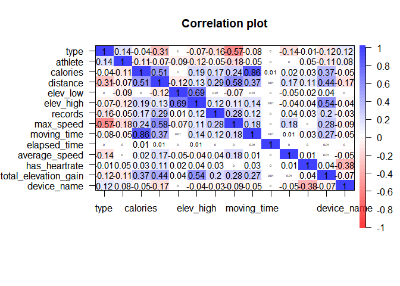
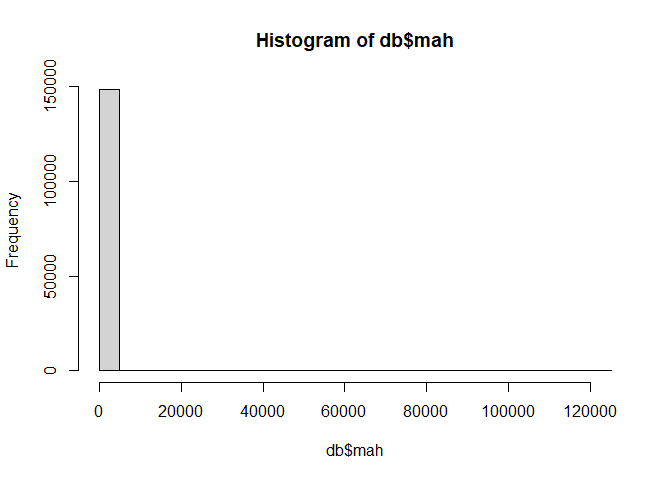
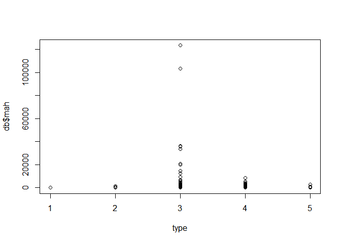
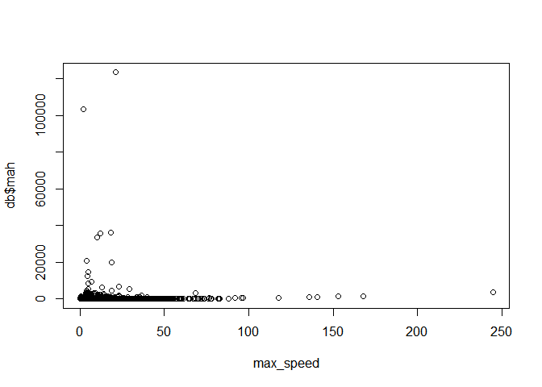
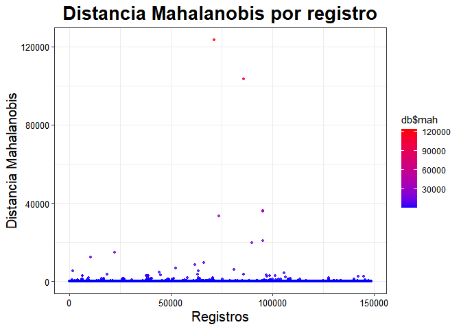
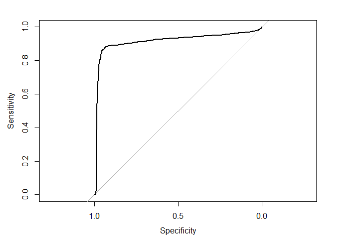
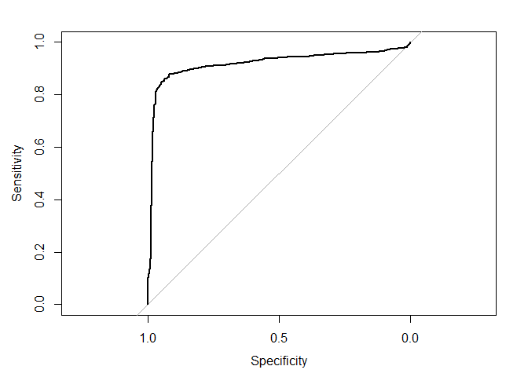

Proyecto 3
================

## Librerias

``` r
library(tidyverse)
```

    ## -- Attaching packages --------------------------------------- tidyverse 1.3.1 --

    ## v ggplot2 3.3.4     v purrr   0.3.4
    ## v tibble  3.1.2     v dplyr   1.0.6
    ## v tidyr   1.1.3     v stringr 1.4.0
    ## v readr   1.4.0     v forcats 0.5.1

    ## -- Conflicts ------------------------------------------ tidyverse_conflicts() --
    ## x dplyr::filter() masks stats::filter()
    ## x dplyr::lag()    masks stats::lag()

``` r
library(GGally)
```

    ## Registered S3 method overwritten by 'GGally':
    ##   method from   
    ##   +.gg   ggplot2

``` r
library(regclass)
```

    ## Loading required package: bestglm

    ## Loading required package: leaps

    ## Loading required package: VGAM

    ## Loading required package: stats4

    ## Loading required package: splines

    ## 
    ## Attaching package: 'VGAM'

    ## The following object is masked from 'package:tidyr':
    ## 
    ##     fill

    ## Loading required package: rpart

    ## Loading required package: randomForest

    ## randomForest 4.6-14

    ## Type rfNews() to see new features/changes/bug fixes.

    ## 
    ## Attaching package: 'randomForest'

    ## The following object is masked from 'package:dplyr':
    ## 
    ##     combine

    ## The following object is masked from 'package:ggplot2':
    ## 
    ##     margin

    ## Important regclass change from 1.3:
    ## All functions that had a . in the name now have an _
    ## all.correlations -> all_correlations, cor.demo -> cor_demo, etc.

``` r
library(pROC)
```

    ## Type 'citation("pROC")' for a citation.

    ## 
    ## Attaching package: 'pROC'

    ## The following objects are masked from 'package:stats':
    ## 
    ##     cov, smooth, var

``` r
library(rsample)
library('corrplot')
```

    ## corrplot 0.89 loaded

``` r
library(dplyr)
library(utf8)
library("ggplot2")
library(stringr)
library(pillar)
```

    ## 
    ## Attaching package: 'pillar'

    ## The following object is masked from 'package:dplyr':
    ## 
    ##     dim_desc

``` r
library("psych")
```

    ## 
    ## Attaching package: 'psych'

    ## The following object is masked from 'package:randomForest':
    ## 
    ##     outlier

    ## The following objects are masked from 'package:VGAM':
    ## 
    ##     fisherz, logistic, logit

    ## The following objects are masked from 'package:ggplot2':
    ## 
    ##     %+%, alpha

``` r
library("car")
```

    ## Loading required package: carData

    ## 
    ## Attaching package: 'car'

    ## The following object is masked from 'package:psych':
    ## 
    ##     logit

    ## The following object is masked from 'package:VGAM':
    ## 
    ##     logit

    ## The following object is masked from 'package:dplyr':
    ## 
    ##     recode

    ## The following object is masked from 'package:purrr':
    ## 
    ##     some

``` r
library("Hmisc")
```

    ## Loading required package: lattice

    ## 
    ## Attaching package: 'lattice'

    ## The following object is masked from 'package:regclass':
    ## 
    ##     qq

    ## Loading required package: survival

    ## Loading required package: Formula

    ## 
    ## Attaching package: 'Hmisc'

    ## The following object is masked from 'package:psych':
    ## 
    ##     describe

    ## The following objects are masked from 'package:dplyr':
    ## 
    ##     src, summarize

    ## The following objects are masked from 'package:base':
    ## 
    ##     format.pval, units

``` r
library("corrplot")
library("recommenderlab")
```

    ## Loading required package: Matrix

    ## 
    ## Attaching package: 'Matrix'

    ## The following objects are masked from 'package:tidyr':
    ## 
    ##     expand, pack, unpack

    ## Loading required package: arules

    ## 
    ## Attaching package: 'arules'

    ## The following object is masked from 'package:car':
    ## 
    ##     recode

    ## The following object is masked from 'package:dplyr':
    ## 
    ##     recode

    ## The following objects are masked from 'package:base':
    ## 
    ##     abbreviate, write

    ## Loading required package: proxy

    ## 
    ## Attaching package: 'proxy'

    ## The following object is masked from 'package:Matrix':
    ## 
    ##     as.matrix

    ## The following objects are masked from 'package:stats':
    ## 
    ##     as.dist, dist

    ## The following object is masked from 'package:base':
    ## 
    ##     as.matrix

    ## Loading required package: registry

    ## Registered S3 methods overwritten by 'registry':
    ##   method               from 
    ##   print.registry_field proxy
    ##   print.registry_entry proxy

``` r
library(readr)
```

## Cargar Datos

``` r
db <- readRDS("endurance (1).rds")
 #View(db)
```

## Limpieza de Datos

Comenzamos eliminando los datos NA.

``` r
db = na.omit(db)
dim(db)
```

    ## [1] 151990     16

Observamos el dataframe y sus tipos de datos.

``` r
str(db)
```

    ## 'data.frame':    151990 obs. of  16 variables:
    ##  $ id                  : int  1 2 3 4 5 6 7 8 9 10 ...
    ##  $ type                : chr  "Ride" "Ride" "Ride" "Ride" ...
    ##  $ athlete             : num  13279977 13279977 13279977 13279977 13279977 ...
    ##  $ calories            : num  521 538 742 314 696 ...
    ##  $ distance            : num  13130 12939 17516 7931 17073 ...
    ##  $ elev_low            : chr  "337.3" "338.5" "301.6" "339.2" ...
    ##  $ records             : chr  "0" "1" "0" "0" ...
    ##  $ elev_high           : chr  "375.6" "477" "377" "389.7" ...
    ##  $ max_speed           : chr  "10.5" "11.4" "11.6" "10.2" ...
    ##  $ device_name         : chr  "Strava iPhone App" "Strava iPhone App" "Strava iPhone App" "Strava iPhone App" ...
    ##  $ moving_time         : num  3908 3791 3837 2280 4188 ...
    ##  $ elapsed_time        : num  4326 4975 4510 2521 4473 ...
    ##  $ average_speed       : chr  "3.36" "3.413" "4.565" "3.479" ...
    ##  $ has_heartrate       : chr  "FALSE" "FALSE" "FALSE" "FALSE" ...
    ##  $ start_date_local    : POSIXct, format: "2015-10-25 07:33:45" "2015-10-23 06:44:01" ...
    ##  $ total_elevation_gain: num  206 288 309 156 269 ...
    ##  - attr(*, "na.action")= 'omit' Named int [1:15625] 31 32 43 44 111 112 113 149 150 196 ...
    ##   ..- attr(*, "names")= chr [1:15625] "31" "32" "43" "44" ...

``` r
summary(db)
```

    ##        id             type              athlete            calories       
    ##  Min.   :     1   Length:151990      Min.   : 8558143   Min.   :     0.0  
    ##  1st Qu.: 41459   Class :character   1st Qu.:14127430   1st Qu.:   300.0  
    ##  Median : 82364   Mode  :character   Median :15550715   Median :   668.0  
    ##  Mean   : 83211                      Mean   :15305007   Mean   :   854.6  
    ##  3rd Qu.:125040                      3rd Qu.:16653350   3rd Qu.:  1130.4  
    ##  Max.   :167615                      Max.   :18078075   Max.   :326157.3  
    ##     distance         elev_low           records           elev_high        
    ##  Min.   :      0   Length:151990      Length:151990      Length:151990     
    ##  1st Qu.:   6986   Class :character   Class :character   Class :character  
    ##  Median :  13609   Mode  :character   Mode  :character   Mode  :character  
    ##  Mean   :  23128                                                           
    ##  3rd Qu.:  28980                                                           
    ##  Max.   :1479320                                                           
    ##   max_speed         device_name         moving_time        elapsed_time      
    ##  Length:151990      Length:151990      Min.   :       0   Min.   :        0  
    ##  Class :character   Class :character   1st Qu.:    2308   1st Qu.:     2702  
    ##  Mode  :character   Mode  :character   Median :    4050   Median :     4788  
    ##                                        Mean   :    5322   Mean   :    34998  
    ##                                        3rd Qu.:    6838   3rd Qu.:     8368  
    ##                                        Max.   :11025474   Max.   :511111044  
    ##  average_speed      has_heartrate      start_date_local             
    ##  Length:151990      Length:151990      Min.   :1999-04-25 17:36:38  
    ##  Class :character   Class :character   1st Qu.:2016-09-28 19:54:35  
    ##  Mode  :character   Mode  :character   Median :2018-11-22 05:56:50  
    ##                                        Mean   :2018-04-09 08:16:20  
    ##                                        3rd Qu.:2020-04-30 10:58:34  
    ##                                        Max.   :2021-02-02 08:52:05  
    ##  total_elevation_gain
    ##  Min.   :    0.0     
    ##  1st Qu.:   35.0     
    ##  Median :  242.0     
    ##  Mean   :  434.3     
    ##  3rd Qu.:  638.0     
    ##  Max.   :59595.0

De lo anterior podemos observar que en variables como moving time,
elapsed time y distance hay un minimo de 0, lo que no tiene mucho
sentido, por lo que veremos cuantas variables tienen valor y las
eliminaremos.

``` r
db %>% filter(moving_time == 0 ) %>% nrow()
```

    ## [1] 348

``` r
db %>% filter(elapsed_time == 0 ) %>% nrow()
```

    ## [1] 137

``` r
db %>% filter(distance == 0 ) %>% nrow() 
```

    ## [1] 3347

``` r
db <- db %>%  filter(moving_time != 0)
db <- db %>%  filter(elapsed_time != 0)
db <- db %>%  filter(distance != 0)

summary(db)
```

    ##        id             type              athlete            calories       
    ##  Min.   :     1   Length:148400      Min.   : 8558143   Min.   :     0.0  
    ##  1st Qu.: 41740   Class :character   1st Qu.:14204866   1st Qu.:   313.2  
    ##  Median : 82775   Mode  :character   Median :15550715   Median :   681.0  
    ##  Mean   : 83522                      Mean   :15308696   Mean   :   868.7  
    ##  3rd Qu.:125654                      3rd Qu.:16653350   3rd Qu.:  1145.3  
    ##  Max.   :167615                      Max.   :18078075   Max.   :326157.3  
    ##     distance           elev_low           records           elev_high        
    ##  Min.   :      0.1   Length:148400      Length:148400      Length:148400     
    ##  1st Qu.:   7374.8   Class :character   Class :character   Class :character  
    ##  Median :  14045.1   Mode  :character   Mode  :character   Mode  :character  
    ##  Mean   :  23686.3                                                           
    ##  3rd Qu.:  29593.0                                                           
    ##  Max.   :1479320.0                                                           
    ##   max_speed         device_name         moving_time       elapsed_time      
    ##  Length:148400      Length:148400      Min.   :      1   Min.   :        1  
    ##  Class :character   Class :character   1st Qu.:   2331   1st Qu.:     2726  
    ##  Mode  :character   Mode  :character   Median :   4113   Median :     4879  
    ##                                        Mean   :   5298   Mean   :    33063  
    ##                                        3rd Qu.:   6921   3rd Qu.:     8483  
    ##                                        Max.   :3156689   Max.   :511111044  
    ##  average_speed      has_heartrate      start_date_local             
    ##  Length:148400      Length:148400      Min.   :1999-04-25 17:36:38  
    ##  Class :character   Class :character   1st Qu.:2016-10-03 10:46:34  
    ##  Mode  :character   Mode  :character   Median :2018-11-26 17:00:52  
    ##                                        Mean   :2018-04-13 09:11:50  
    ##                                        3rd Qu.:2020-05-07 05:02:29  
    ##                                        Max.   :2021-02-02 08:30:38  
    ##  total_elevation_gain
    ##  Min.   :    0.0     
    ##  1st Qu.:   41.0     
    ##  Median :  259.0     
    ##  Mean   :  444.8     
    ##  3rd Qu.:  649.0     
    ##  Max.   :59595.0

Ahora, revisaremos la cantidad de factores de algunas variables para ver
si efectivamente seran utiles para nuestro analisis posterior. (En el
caso que tengan cantidad de factores similar a la cantidad de filas o
cantidad de factores igual a 1, esta variable se eliminaria)

``` r
db$athlete<-as.factor(db$athlete)
db$device_name<-as.factor(db$device_name)
db$records<-as.factor(db$records)
db$type<-as.factor(db$type)
db$has_heartrate<-as.factor(db$has_heartrate)

str(db)
```

    ## 'data.frame':    148400 obs. of  16 variables:
    ##  $ id                  : int  1 2 3 4 5 6 7 8 9 10 ...
    ##  $ type                : Factor w/ 5 levels "EBikeRide","Hike",..: 3 3 3 3 3 3 3 3 3 3 ...
    ##  $ athlete             : Factor w/ 480 levels "8558143.17774519",..: 27 27 27 27 27 27 27 27 27 27 ...
    ##  $ calories            : num  521 538 742 314 696 ...
    ##  $ distance            : num  13130 12939 17516 7931 17073 ...
    ##  $ elev_low            : chr  "337.3" "338.5" "301.6" "339.2" ...
    ##  $ records             : Factor w/ 170 levels "0","1","10","100",..: 1 2 1 1 2 1 1 2 2 1 ...
    ##  $ elev_high           : chr  "375.6" "477" "377" "389.7" ...
    ##  $ max_speed           : chr  "10.5" "11.4" "11.6" "10.2" ...
    ##  $ device_name         : Factor w/ 156 levels "Android Wear",..: 131 131 131 131 131 131 131 131 131 131 ...
    ##  $ moving_time         : num  3908 3791 3837 2280 4188 ...
    ##  $ elapsed_time        : num  4326 4975 4510 2521 4473 ...
    ##  $ average_speed       : chr  "3.36" "3.413" "4.565" "3.479" ...
    ##  $ has_heartrate       : Factor w/ 2 levels "FALSE","TRUE": 1 1 1 1 1 1 1 1 1 1 ...
    ##  $ start_date_local    : POSIXct, format: "2015-10-25 07:33:45" "2015-10-23 06:44:01" ...
    ##  $ total_elevation_gain: num  206 288 309 156 269 ...
    ##  - attr(*, "na.action")= 'omit' Named int [1:15625] 31 32 43 44 111 112 113 149 150 196 ...
    ##   ..- attr(*, "names")= chr [1:15625] "31" "32" "43" "44" ...

Segun lo anterior, cambiamos los tipos de variable a numérica para su
posterior procesamiento.

``` r
db$calories<-as.numeric(db$calories)
db$distance<-as.numeric(db$distance)
db$elev_low<-as.numeric(db$elev_low)
db$elev_high<-as.numeric(db$elev_high)
db$max_speed<-as.numeric(db$max_speed)
db$average_speed<-as.numeric(db$average_speed)
db$has_heartrate<-as.numeric(db$has_heartrate)
db$total_elevation_gain<-as.numeric(db$total_elevation_gain)
db$athlete<-as.numeric(db$athlete)
db$records<-as.numeric(db$records)
db$device_name<-as.numeric(db$device_name)
db$type<-as.numeric(db$type)

str(db)
```

    ## 'data.frame':    148400 obs. of  16 variables:
    ##  $ id                  : int  1 2 3 4 5 6 7 8 9 10 ...
    ##  $ type                : num  3 3 3 3 3 3 3 3 3 3 ...
    ##  $ athlete             : num  27 27 27 27 27 27 27 27 27 27 ...
    ##  $ calories            : num  521 538 742 314 696 ...
    ##  $ distance            : num  13130 12939 17516 7931 17073 ...
    ##  $ elev_low            : num  337 338 302 339 336 ...
    ##  $ records             : num  1 2 1 1 2 1 1 2 2 1 ...
    ##  $ elev_high           : num  376 477 377 390 389 ...
    ##  $ max_speed           : num  10.5 11.4 11.6 10.2 14.2 6.8 11.5 9.9 15.9 10.1 ...
    ##  $ device_name         : num  131 131 131 131 131 131 131 131 131 131 ...
    ##  $ moving_time         : num  3908 3791 3837 2280 4188 ...
    ##  $ elapsed_time        : num  4326 4975 4510 2521 4473 ...
    ##  $ average_speed       : num  3.36 3.41 4.57 3.48 4.08 ...
    ##  $ has_heartrate       : num  1 1 1 1 1 1 1 1 1 1 ...
    ##  $ start_date_local    : POSIXct, format: "2015-10-25 07:33:45" "2015-10-23 06:44:01" ...
    ##  $ total_elevation_gain: num  206 288 309 156 269 ...
    ##  - attr(*, "na.action")= 'omit' Named int [1:15625] 31 32 43 44 111 112 113 149 150 196 ...
    ##   ..- attr(*, "names")= chr [1:15625] "31" "32" "43" "44" ...

Una vez ya listos nuestro datos, realizamos una visualizacion de nuestro
datos numericos, para ver la correlacion que pueda existir entre las
variables y la distribucion de los datos.

Del gráfico se puede inferir: -variable distance esta alta e
indirectamente relacionada con la variable type (variable a
predecir).(-0,3) -variable distance esta alta y directamente relacionada
con la variable calories. (0,51) -variable distance esta alta y
directamente relacionada con la variable max\_speed.(0,59) -variable
distance esta alta y directamente relacionada con la variable
total\_elevation\_gain.(0,44) -variable max\_speed esta alta e
indirectamente relacionada con la variable type.(-0,53)

Nosotras intuimos que las varibales que tienen que ver con elevación
podrian estar tratando de explicar lo mismo. Es por esto, que luego de
realizar la correlación entre estas, vimos que la variable elev\_high
esta alta y directamente relacionada con las variables elev\_low y
total\_elevation\_gain. Por lo tanto, decidimos eliminar esta variable
ya que nos parece redundante para nuestro analisis. Ademas, la variable
elev\_high y type tien una correlación casi igual a 0, lo que quiere
decir que esta variable no explica nada la variable a predecir.

Mas allá de lo que dicen los datos, bajo nuestros conocimientos sobre el
contexto del problema, es decir, “deporte” y lo que sabemos acerca de
los tributos.

De lo anterior, las variables que nombramos en el listado, podrian ser
las variables mas relevantes para nuestro modelo.

``` r
attach(db)

cor.plot(cbind(type, athlete, calories, distance, elev_low, elev_high, records, max_speed, moving_time, elapsed_time, average_speed, has_heartrate, total_elevation_gain, device_name))
```

<!-- -->

``` r
cor(x = cbind(type, athlete, calories, distance, elev_low, elev_high, records, max_speed, moving_time, elapsed_time, average_speed, has_heartrate, total_elevation_gain,  device_name), method = "pearson")
```

    ##                               type      athlete     calories     distance
    ## type                  1.0000000000  0.138911480 -0.044100018 -0.310809971
    ## athlete               0.1389114799  1.000000000 -0.114075161 -0.068628620
    ## calories             -0.0441000175 -0.114075161  1.000000000  0.511340019
    ## distance             -0.3108099707 -0.068628620  0.511340019  1.000000000
    ## elev_low             -0.0006480880 -0.090540366 -0.004048849 -0.123110463
    ## elev_high            -0.0685935002 -0.121854856  0.189208150  0.125780027
    ## records              -0.1608795357 -0.047519112  0.170991284  0.290023810
    ## max_speed            -0.5714385024 -0.182454340  0.235850357  0.580546677
    ## moving_time          -0.0813156813 -0.048504638  0.855736378  0.374395432
    ## elapsed_time          0.0004384296 -0.002876573  0.009658792  0.008215961
    ## average_speed        -0.1387521908 -0.001739654  0.024578645  0.174682614
    ## has_heartrate        -0.0147036058  0.050112431  0.028865304  0.112095888
    ## total_elevation_gain -0.1239152694 -0.114906261  0.371558891  0.436896265
    ## device_name           0.1190713194  0.083997013 -0.053059280 -0.172826819
    ##                          elev_low    elev_high      records    max_speed
    ## type                 -0.000648088 -0.068593500 -0.160879536 -0.571438502
    ## athlete              -0.090540366 -0.121854856 -0.047519112 -0.182454340
    ## calories             -0.004048849  0.189208150  0.170991284  0.235850357
    ## distance             -0.123110463  0.125780027  0.290023810  0.580546677
    ## elev_low              1.000000000  0.685567607  0.008963004 -0.068937264
    ## elev_high             0.685567607  1.000000000  0.117714380  0.113395956
    ## records               0.008963004  0.117714380  1.000000000  0.284684679
    ## max_speed            -0.068937264  0.113395956  0.284684679  1.000000000
    ## moving_time           0.006487169  0.144064249  0.120399261  0.184332458
    ## elapsed_time          0.001585785  0.006976945  0.003774630  0.003443026
    ## average_speed        -0.052599778 -0.037771424  0.041378828  0.177881497
    ## has_heartrate         0.018526700  0.035632110  0.030318310  0.002421710
    ## total_elevation_gain  0.041170090  0.541691377  0.199671073  0.284124307
    ## device_name          -0.001561284 -0.035025250 -0.028705764 -0.086695040
    ##                       moving_time  elapsed_time average_speed has_heartrate
    ## type                 -0.081315681  0.0004384296  -0.138752191 -0.0147036058
    ## athlete              -0.048504638 -0.0028765734  -0.001739654  0.0501124307
    ## calories              0.855736378  0.0096587918   0.024578645  0.0288653045
    ## distance              0.374395432  0.0082159606   0.174682614  0.1120958884
    ## elev_low              0.006487169  0.0015857854  -0.052599778  0.0185267004
    ## elev_high             0.144064249  0.0069769454  -0.037771424  0.0356321099
    ## records               0.120399261  0.0037746302   0.041378828  0.0303183096
    ## max_speed             0.184332458  0.0034430264   0.177881497  0.0024217096
    ## moving_time           1.000000000  0.0061135311   0.009755157  0.0333454376
    ## elapsed_time          0.006113531  1.0000000000   0.001467442  0.0005737263
    ## average_speed         0.009755157  0.0014674422   1.000000000  0.0124238256
    ## has_heartrate         0.033345438  0.0005737263   0.012423826  1.0000000000
    ## total_elevation_gain  0.266075158  0.0060677340   0.006117745  0.0447847565
    ## device_name          -0.051000954 -0.0045958149  -0.049686400 -0.3828595869
    ##                      total_elevation_gain  device_name
    ## type                         -0.123915269  0.119071319
    ## athlete                      -0.114906261  0.083997013
    ## calories                      0.371558891 -0.053059280
    ## distance                      0.436896265 -0.172826819
    ## elev_low                      0.041170090 -0.001561284
    ## elev_high                     0.541691377 -0.035025250
    ## records                       0.199671073 -0.028705764
    ## max_speed                     0.284124307 -0.086695040
    ## moving_time                   0.266075158 -0.051000954
    ## elapsed_time                  0.006067734 -0.004595815
    ## average_speed                 0.006117745 -0.049686400
    ## has_heartrate                 0.044784757 -0.382859587
    ## total_elevation_gain          1.000000000 -0.065547542
    ## device_name                  -0.065547542  1.000000000

# Detección de datos ingresados erroneamente (Outliers)

Haremos detección de outliers con la técnica de mahalanobis.

Del histograma lo unico que se puede concluir es que hay muy pocos
outliers o registros mal hechos.

Del grafico de type vs mah, podemos observar que la mayor cantidad de
outliers se encuentra registrado para el type=3.

Del grafico max\_speed vs mah, podemos observar que la mayor cantidad de
outliers se encuentra en velocidades muy bajas.

De lo anterior, se puede deducir que quizas hay muchos registros
erroneos donde el type=3 (que es posible que sea de una actividad en
bicicleta), tenga registrada una velocidad maxima muy baja, lo que no
tiene mucho sentido, por lo que se considerarán outliers.

``` r
db$mah = mahalanobis(cbind(type, athlete, calories, distance, elev_low, elev_high, records, max_speed, moving_time, elapsed_time, average_speed, has_heartrate, total_elevation_gain, device_name) ,
                            colMeans(cbind(type, athlete, calories, distance, elev_low, elev_high, records, max_speed, moving_time, elapsed_time, average_speed, has_heartrate, total_elevation_gain, device_name)),
                            cov(cbind(type, athlete, calories, distance, elev_low, elev_high, records, max_speed, moving_time, elapsed_time, average_speed, has_heartrate, total_elevation_gain, device_name)))

hist(db$mah)
```

<!-- -->

``` r
plot(type,db$mah)
```

<!-- -->

``` r
plot(max_speed,db$mah)
```

<!-- --> Aqui
graficaremos todas las observaciones, donde en una escala de colores
será posible identificar las observaciones con una mayor distancia de
mahalanobis, la que se considerará como outlier.

Del gráfico se puede inferir que muchos outliers no hay, pero el numero
maximo es muy alto. Consideraremos una distancia de mahanalis sobre 1000
un outlier.

``` r
max(db$mah)
```

    ## [1] 123426.4

``` r
min(db$mah)
```

    ## [1] 1.44255

``` r
ggplot(data=db, aes(x=c(1:148400),y=db$mah,color=db$mah)) +
  geom_point(size=1,alpha=0.8)+theme_bw()+
  scale_color_gradient(low="blue",high="red")+
  ggtitle("Distancia Mahalanobis por registro") + 
  theme_bw() +
  theme(plot.title = element_text(size = 20, face="bold", hjust=0.5),
        axis.title = element_text(size = 15),
        axis.text = element_text(size = 10, color="black")) +
  xlab("Registros") + 
  ylab("Distancia Mahalanobis") 
```

<!-- -->
\#Eliminacion de outliers

Viendo las diemnsiones de la base de datos antes y despues de la
eliminacion de outliers, reafirmamos lo dicho anteriormente, con que son
muy pocos los que tienen un valor muy alto.

``` r
dim(db)
```

    ## [1] 148400     17

``` r
db <- filter(db, db$mah < 1000 )
dim(db)
```

    ## [1] 148292     17

``` r
##db<-na.omit(db)


glimpse(db)
```

    ## Rows: 148,292
    ## Columns: 17
    ## $ id                   <int> 1, 2, 3, 4, 5, 6, 7, 8, 9, 10, 11, 12, 13, 14, 15~
    ## $ type                 <dbl> 3, 3, 3, 3, 3, 3, 3, 3, 3, 3, 3, 3, 3, 3, 3, 3, 3~
    ## $ athlete              <dbl> 27, 27, 27, 27, 27, 27, 27, 27, 27, 27, 27, 27, 2~
    ## $ calories             <dbl> 520.9, 538.0, 741.6, 314.5, 696.5, 109.1, 510.9, ~
    ## $ distance             <dbl> 13130.5, 12938.7, 17515.7, 7931.4, 17072.7, 3195.~
    ## $ elev_low             <dbl> 337.3, 338.5, 301.6, 339.2, 336.2, 333.6, 336.1, ~
    ## $ records              <dbl> 1, 2, 1, 1, 2, 1, 1, 2, 2, 1, 1, 1, 1, 1, 1, 1, 1~
    ## $ elev_high            <dbl> 375.6, 477.0, 377.0, 389.7, 389.4, 369.1, 379.9, ~
    ## $ max_speed            <dbl> 10.5, 11.4, 11.6, 10.2, 14.2, 6.8, 11.5, 9.9, 15.~
    ## $ device_name          <dbl> 131, 131, 131, 131, 131, 131, 131, 131, 131, 131,~
    ## $ moving_time          <dbl> 3908, 3791, 3837, 2280, 4188, 1237, 2873, 2439, 5~
    ## $ elapsed_time         <dbl> 4326, 4975, 4510, 2521, 4473, 4166, 3390, 2759, 5~
    ## $ average_speed        <dbl> 3.360, 3.413, 4.565, 3.479, 4.077, 2.583, 4.363, ~
    ## $ has_heartrate        <dbl> 1, 1, 1, 1, 1, 1, 1, 1, 1, 1, 1, 1, 1, 1, 1, 1, 1~
    ## $ start_date_local     <dttm> 2015-10-25 07:33:45, 2015-10-23 06:44:01, 2015-1~
    ## $ total_elevation_gain <dbl> 206.0, 287.9, 309.1, 156.4, 268.8, 36.3, 192.6, 1~
    ## $ mah                  <dbl> 5.550304, 5.311633, 5.423596, 5.630268, 5.652128,~

``` r
set.seed(369)
glm1 <- glm(type ~ max_speed, data = db)

summary(glm1)
```

    ## 
    ## Call:
    ## glm(formula = type ~ max_speed, data = db)
    ## 
    ## Deviance Residuals: 
    ##     Min       1Q   Median       3Q      Max  
    ## -2.9168  -0.2604  -0.0278   0.2980   6.5247  
    ## 
    ## Coefficients:
    ##               Estimate Std. Error t value Pr(>|t|)    
    ## (Intercept)  3.9525513  0.0025446  1553.3   <2e-16 ***
    ## max_speed   -0.0596646  0.0002175  -274.4   <2e-16 ***
    ## ---
    ## Signif. codes:  0 '***' 0.001 '**' 0.01 '*' 0.05 '.' 0.1 ' ' 1
    ## 
    ## (Dispersion parameter for gaussian family taken to be 0.2041986)
    ## 
    ##     Null deviance: 45652  on 148291  degrees of freedom
    ## Residual deviance: 30281  on 148290  degrees of freedom
    ## AIC: 185253
    ## 
    ## Number of Fisher Scoring iterations: 2

``` r
prob <- predict(glm1)

db$prob <- prob

curva_roc <- roc(type ~ prob, data = db)
```

    ## Warning in roc.default(response, predictors[, 1], ...): 'response' has more
    ## than two levels. Consider setting 'levels' explicitly or using 'multiclass.roc'
    ## instead

    ## Setting levels: control = 1, case = 2

    ## Setting direction: controls < cases

``` r
plot(curva_roc)
```

<!-- -->

``` r
auc(curva_roc)
```

    ## Area under the curve: 0.9137

``` r
modelo_log_multi <- glm(type ~ athlete + calories +  max_speed + distance  , data = db)

summary(modelo_log_multi)
```

    ## 
    ## Call:
    ## glm(formula = type ~ athlete + calories + max_speed + distance, 
    ##     data = db)
    ## 
    ## Deviance Residuals: 
    ##     Min       1Q   Median       3Q      Max  
    ## -2.9018  -0.2448  -0.0218   0.2759   6.5039  
    ## 
    ## Coefficients:
    ##               Estimate Std. Error t value Pr(>|t|)    
    ## (Intercept)  3.808e+00  3.507e-03 1085.90   <2e-16 ***
    ## athlete      3.386e-04  1.078e-05   31.42   <2e-16 ***
    ## calories     1.752e-04  2.034e-06   86.14   <2e-16 ***
    ## max_speed   -5.697e-02  2.743e-04 -207.68   <2e-16 ***
    ## distance    -3.615e-06  7.443e-08  -48.56   <2e-16 ***
    ## ---
    ## Signif. codes:  0 '***' 0.001 '**' 0.01 '*' 0.05 '.' 0.1 ' ' 1
    ## 
    ## (Dispersion parameter for gaussian family taken to be 0.1938915)
    ## 
    ##     Null deviance: 45652  on 148291  degrees of freedom
    ## Residual deviance: 28752  on 148287  degrees of freedom
    ## AIC: 177575
    ## 
    ## Number of Fisher Scoring iterations: 2

``` r
prob_multi <- predict(modelo_log_multi, type = c("response"))

db$prob_multi <- prob_multi

curva_roc_multi <- roc(type ~ prob_multi, data = db)
```

    ## Warning in roc.default(response, predictors[, 1], ...): 'response' has more
    ## than two levels. Consider setting 'levels' explicitly or using 'multiclass.roc'
    ## instead

    ## Setting levels: control = 1, case = 2

    ## Setting direction: controls < cases

``` r
plot(curva_roc_multi)
```

<!-- -->

``` r
auc(curva_roc_multi)
```

    ## Area under the curve: 0.9159

``` r
set.seed(369)

data_split <- initial_split(db,
                            prop = 0.7,
                            strata = NULL)

train_data <- training(data_split) %>% as.data.frame() 
test_data <- testing(data_split) %>%  as.data.frame()

test_data$prob_multi <- predict(modelo_log_multi, test_data, type = c("response"))
auc(roc(type ~ prob_multi, data = test_data))
```

    ## Warning in roc.default(response, predictors[, 1], ...): 'response' has more
    ## than two levels. Consider setting 'levels' explicitly or using 'multiclass.roc'
    ## instead

    ## Setting levels: control = 1, case = 2

    ## Setting direction: controls < cases

    ## Area under the curve: 0.9278
